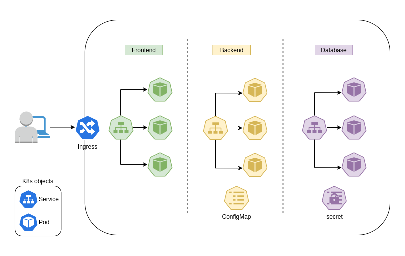

# Helm Charts

[<< Back](./README.md)

## Chart Projects

A Helm Chart groups all YAML definitions required to deploy a working version of our developed projects including its metadata, default values and after deployment instruction.

Charts can be converted to a package (tar.gz file) and shared directly or using a private or public Helm Repository.

### Helm Chart sample 

Sample project diagram



```bash
# to create a Chart project directory and basic structure
export PROJECT=myapp
helm create $PROJECT
```

The above command will create a directory with the following structure.

```ASCII
myapp
├── charts
├── Chart.yaml
├── templates
│   ├── deployment.yaml
│   ├── _helpers.tpl
│   ├── hpa.yaml
│   ├── ingress.yaml
│   ├── NOTES.txt
│   ├── serviceaccount.yaml
│   ├── service.yaml
│   └── tests
│       └── test-connection.yaml
└── values.yaml
```

#### *templates/* directory

In *templates/* folder we place YAML definitions for all Kubernetes objects we need for our project.
The "helm create" command gived us same examples:

- deployment.yaml
- hpa.yaml
- ingress.yaml
- serviceaccount.yaml
- service.yaml

We can replace, delete or create some other files.

To validate the syntax of our Chart templates and files we can rum:

```bash
helm lint ./$PROJECT
```

A valid Chart will output something like:

```output
==> Linting ./myapp
[INFO] Chart.yaml: icon is recommended

1 chart(s) linted, 0 chart(s) failed
```

Commands like, "helm install" or "helm update" will trigger Helm template rendering engine. It extends, adding a number of utility functions for writing charts, the [*GoLang "template" package*](https://golang.org/pkg/text/template/) that searchs for strings delimited by "{{" and "}}". This are called "Actions" and they can be "data evaluations" or "control structures".

Checking the content of the "templates/service.yaml" sample file we can identify some template actions.

```yaml
apiVersion: v1
kind: Service
metadata:
  name: {{ include "myapp.fullname" . }}
  labels:
    {{- include "myapp.labels" . | nindent 4 }}
spec:
  type: {{ .Values.service.type }}
  ports:
    - port: {{ .Values.service.port }}
      targetPort: http
      protocol: TCP
      name: http
  selector:
    {{- include "myapp.selectorLabels" . | nindent 4 }}
```

Checking the output (on dry-run mode) of a "helm install" command we will get the rendered version of the above Service template.

```bash
helm install --dry-run --debug ./$PROJECT --generate-name
```

Results:

```yaml
# Source: myapp/templates/service.yaml
apiVersion: v1
kind: Service
metadata:
  name: myapp-1604707407
  labels:
    helm.sh/chart: myapp-0.1.0
    app.kubernetes.io/name: myapp
    app.kubernetes.io/instance: myapp-1604707407
    app.kubernetes.io/version: "1.16.0"
    app.kubernetes.io/managed-by: Helm
spec:
  type: ClusterIP
  ports:
    - port: 80
      targetPort: http
      protocol: TCP
      name: http
  selector:
    app.kubernetes.io/name: myapp
    app.kubernetes.io/instance: myapp-1604707407
```

This (default) values that were injected to the template came from "values.yaml" file.

#### values.yaml

We can get the default values included in a Chart (values.yaml file) by running the following command:

 ```bash
helm show values ./$PROJECT # for values
# or
helm show all ./$PROJECT # to get all information of the chart

# other option of show mode are:
helm show chart ./$PROJECT # for values
helm show readme ./$PROJECT # for values
```

On the values output we can filter the ones used on our Service sample template:

```yaml
# Default values for myapp.
# This is a YAML-formatted file.
# Declare variables to be passed into your templates.
# (...)
service:
  type: ClusterIP
  port: 80
# (...)
```

As we can see fields like "myapp.fullname", "myapp.labels" and "myapp.selectorLabels" that are present on the template and were rendered are not in the values.yaml file (or output). So, were are them? Maybe metadate?

#### Chart.yaml

This file stores the metadata of our project.
Here we can define the project name and description. 
The minimum required cluster and helm versions and the current Chart version so we can then manage helm upgrades or rollbacks.

This metadata file include fields like:

```yaml
apiVersion: v2
name: myapp
description: A Helm chart for Kubernetes
type: application
version: 0.1.0
appVersion: 1.16.0
```

But we still not finding the three "mystery" fields used on our Service template ("myapp.fullname", "myapp.labels" and "myapp.selectorLabels").

Looking closer at our Chart tree file we will find another "strange"/diferrent filename at templates directory: the "_helpers.tpl" file.


#### templates/_helpers.tpl

Beside of Kubernetes manifests YAML (or templates) files we found inside "templates" folder, we also find the "_helpers.tpl" file. This file is the default location for template partials and helpers.

Files whose name begins with an underscore (_) are assumed to not have a manifest inside.

These files are not rendered to Kubernetes object definitions, but are available everywhere within other chart templates for use.

Content of "templates/_helpers.tpl":

```jinja
{{/*
Expand the name of the chart.
*/}}
{{- define "myapp.name" -}}
{{- default .Chart.Name .Values.nameOverride | trunc 63 | trimSuffix "-" }}
{{- end }}

{{/*
Create a default fully qualified app name.
We truncate at 63 chars because some Kubernetes name fields are limited to this (by the DNS naming spec).
If release name contains chart name it will be used as a full name.
*/}}
{{- define "myapp.fullname" -}}
{{- if .Values.fullnameOverride }}
{{- .Values.fullnameOverride | trunc 63 | trimSuffix "-" }}
{{- else }}
{{- $name := default .Chart.Name .Values.nameOverride }}
{{- if contains $name .Release.Name }}
{{- .Release.Name | trunc 63 | trimSuffix "-" }}
{{- else }}
{{- printf "%s-%s" .Release.Name $name | trunc 63 | trimSuffix "-" }}
{{- end }}
{{- end }}
{{- end }}

{{/*
Create chart name and version as used by the chart label.
*/}}
{{- define "myapp.chart" -}}
{{- printf "%s-%s" .Chart.Name .Chart.Version | replace "+" "_" | trunc 63 | trimSuffix "-" }}
{{- end }}

{{/*
Common labels
*/}}
{{- define "myapp.labels" -}}
helm.sh/chart: {{ include "myapp.chart" . }}
{{ include "myapp.selectorLabels" . }}
{{- if .Chart.AppVersion }}
app.kubernetes.io/version: {{ .Chart.AppVersion | quote }}
{{- end }}
app.kubernetes.io/managed-by: {{ .Release.Service }}
{{- end }}

{{/*
Selector labels
*/}}
{{- define "myapp.selectorLabels" -}}
app.kubernetes.io/name: {{ include "myapp.name" . }}
app.kubernetes.io/instance: {{ .Release.Name }}
{{- end }}

{{/*
Create the name of the service account to use
*/}}
{{- define "myapp.serviceAccountName" -}}
{{- if .Values.serviceAccount.create }}
{{- default (include "myapp.fullname" .) .Values.serviceAccount.name }}
{{- else }}
{{- default "default" .Values.serviceAccount.name }}
{{- end }}
{{- end }}
```

Here they are, our "mystery" fields, are being "defined" here.

The **define** function allows us to set fields or named templates inside of another template file.

By convention, every **define** actions should have a simple documentation block ({{/* ... */}}) describing what they do.

Even though this definition is in _helpers.tpl, it can still be accessed in other YAML template files, because template names are global.

Since templates in subcharts are compiled together with top-level templates is good pratice to prefix each defined template with the name of the chart:
{{- define "myapp.labels" -}}

How do we use this defined fields or templates:

- for fields we use: "include"
- for templates: "template"
  
E.g. of "include":

```jinja
{{- define "myapp.fullname" -}}
```

```yaml
apiVersion: v1
kind: Service
metadata:
  name: {{ include "myapp.fullname" . }}
# (...)
```

E.g. of "template" (not present on our Chart project sample):

```jinja
{{/* Generate basic labels */}}
{{- define "mychart.labels" }}
  labels:
    generator: helm
    date: {{ now | htmlDate }}
    chart: {{ .Chart.Name }}
    version: {{ .Chart.Version }}
{{- end }}
```

```yaml
apiVersion: v1
kind: ConfigMap
metadata:
  name: {{ .Release.Name }}-configmap
  {{- template "mychart.labels" . }}
```

Rendered output:

```yaml
# Source: mychart/templates/configmap.yaml
apiVersion: v1
kind: ConfigMap
metadata:
  name: plinking-anaco-configmap
  labels:
    generator: helm
    date: 2016-11-02
    chart: mychart
    version: 0.1.0
```

Tip: Note that we pass . at the end of the template call. This is related with the scope of a template. For more info go [here](https://helm.sh/docs/chart_template_guide/named_templates/).

#### templates/NOTES.txt


